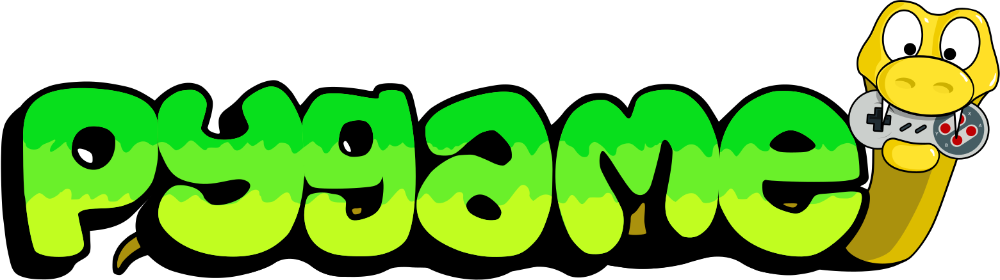
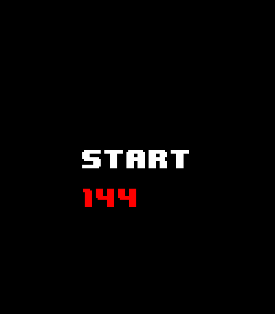
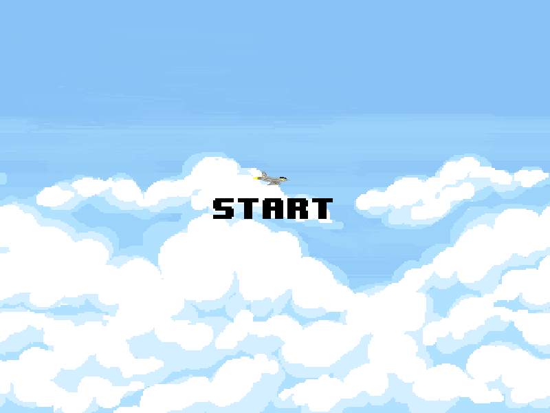
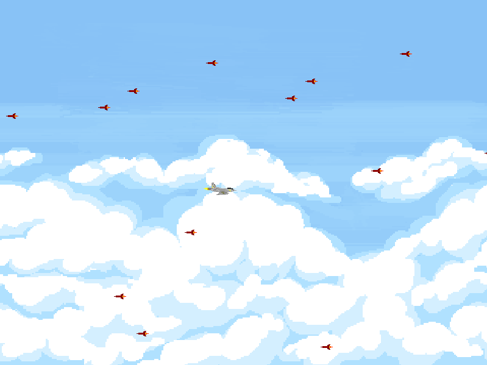
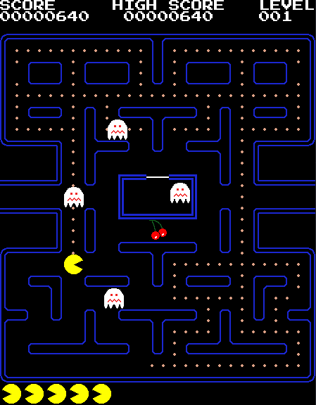
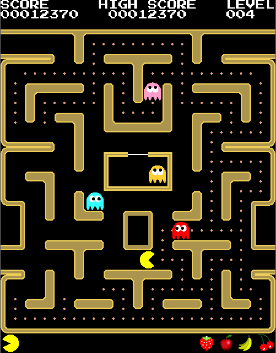
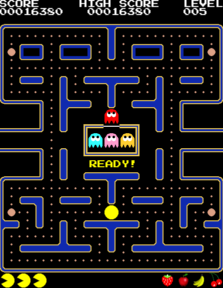

<html lang="en">
    <body>
        

            <a href="https://www.pygame.org/news">
                <picture>
                    <source media="(prefers-color-scheme: dark)" srcset="pygame_logotype.svg">
                    <source media="(prefers-color-scheme: light)" srcset="pygame_logotype.svg">
                    
                </picture>
            </a>
        

    </body>
</html>

## Button Demo

    This simple demo showcases a start button that increments a counter on every click or return command.

## Aerial Evader

    Aerial Evader is my first PyGame and my introduction to the framework.

|                        Menu                        |                      Execution                       |
|:--------------------------------------------------:|:----------------------------------------------------:|
|  |  | 

## Py-Man

    Py-Man is my second PyGame. It is a project that is still in progress (I.P.).

|               Level 001                |               Level 003                |               Level 005                |
|:--------------------------------------:|:--------------------------------------:|:--------------------------------------:|
|  |  |  |

