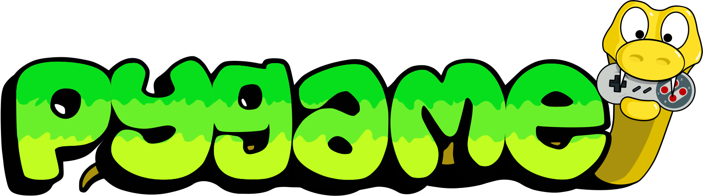
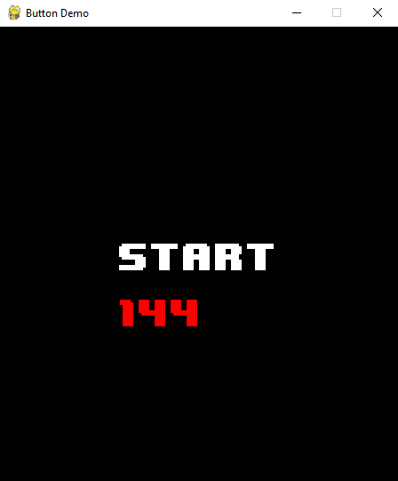
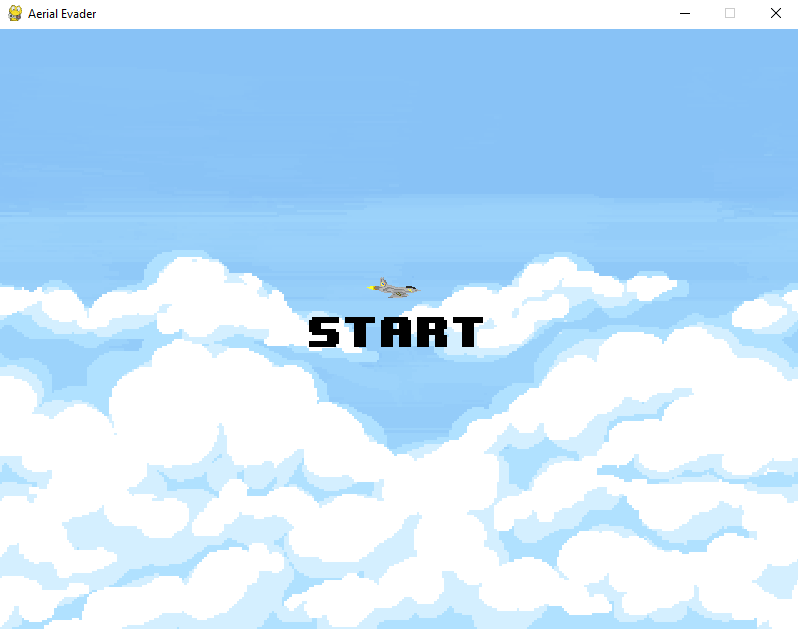
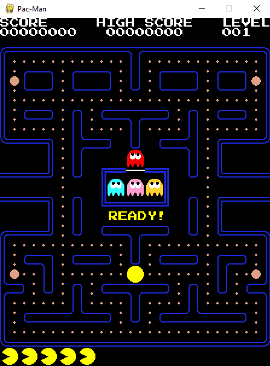
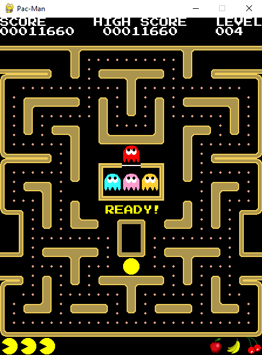
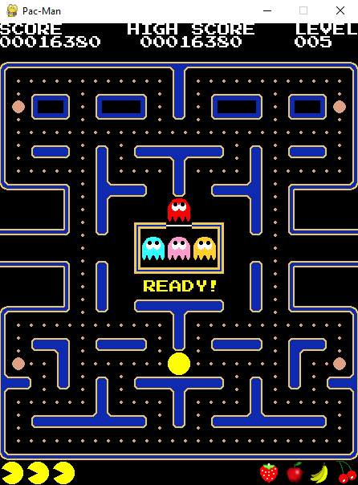

<body>

    <a href="https://www.pygame.org/news">
        <picture>
            <source media="(prefers-color-scheme: dark)" srcset="PyGame_logo.svg">
            <source media="(prefers-color-scheme: light)" srcset="PyGame_logo.svg">
            
        </picture>
    </a>

 
</body>

---

# Button Demo

    This simple demo showcases a start button that increments a counter on every click or return

# Aerial Evader

    This's my first official PyGame. 
    
    Upon reviewal, you'll notice that my codebase's filled with abundance of comments 
    describing the functionalities of every class, code, and blocks, respectively. 

# Pac-Man

    This's my second official PyGame.

    This project's still in progress (IP)

#

#

